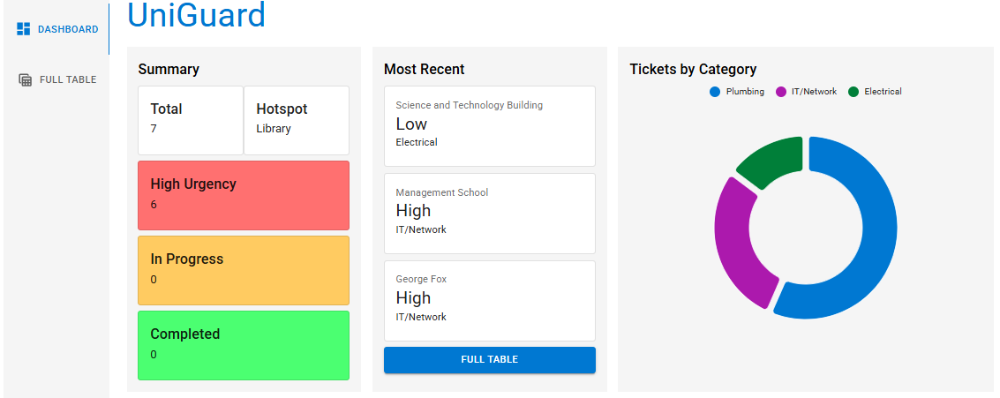

# Uni Guard: Campus Maintenance Reporting System

**A responsive, modern facility management and ticketing dashboard designed to help university administrators track, triage, and resolve maintenance requests.**
Built with scalability and user experience in mind, the application transforms raw ticketing data into actionable, easy-to-read metrics.

## Frontend

> [!NOTE]
> I wanted to create this project to practice my frontend, this was done in around 6 days! This was my first ever project creating an actual front-end: I had no experience using these tools and gave myself a deadline to learn as much as I can. Please mind the messy code and file management :)

### Built with:

- **Framework:** React.js (via Vite)
- **UI Component Library:** [Material UI](https://mui.com/material-ui/getting-started/supported-components/) (MUI)
- **Data Visualization:** MUI X Charts
- **Routing:** React Router DOM (HashRouter)
- **Data Management:** RESTful interactions with a mock backend API ([My JSON Server](https://my-json-server.typicode.com/) + db.json)

## What I Learned

During this project, I gained hands-on experience with advanced React patterns, including:

- Architecting nested routes to have a persistent sidebar layout.
- Learning first-hand how to handle API endpoints.
- Researching what is best for a ticketing system, organising my pages, and exploring different UI options.

## Improvements

It is to be expected that this project isn't perfect, and have many ideas for how I could improve the experience of users. However, due to time constraints, I have had to cut corners. Here's what I had planned:

- Being able to send images through tickets.
- Visible error messages for users.
- Advanced table and graph filtering.
- Trello-style board with draggable tickets.
